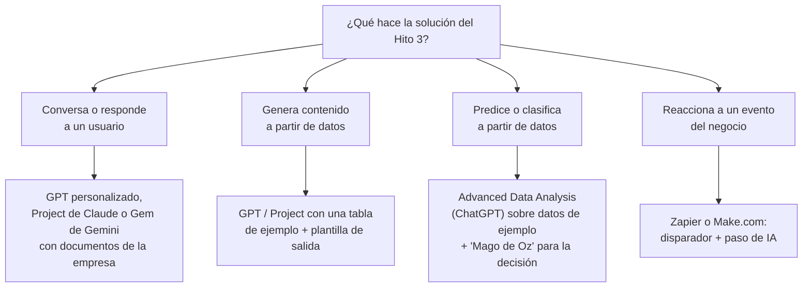

# Clase 11 · Chatbots, Contenido Personalizado y Prototipos sin Programar

<div class="usm-session-meta">
<span>📅 Lunes 21 de septiembre de 2026</span>
<span>⏱️ 90 minutos</span>
<span class="usm-tag-gold">Unidad 2 · IA Generativa y Experiencia del Cliente</span>
</div>

!!! tip "¿Buscas cómo construir el prototipo, paso a paso?"
    Esta clase explica **qué** se puede construir y con qué herramientas. Si lo que necesitas es la
    receta concreta —qué pasos seguir, qué cuenta como prototipo, cómo inventar los datos y un
    ejemplo completo resuelto— está en la **[Clase 12](clase12.md)**.

!!! note "Sesión formativa (sin hito) — manos a la obra"
    No hay entrega evaluada hoy, pero esta clase es la base directa del **Hito 4 — Prototipo
    funcional v1**, que se trabaja en la [Clase 12](clase12.md) y se entrega el **miércoles 23 de
    septiembre**. Traigan computador: la segunda mitad de la clase es para empezar a construir.

## 🎯 Objetivos de la sesión

- Reconocer las tres formas más comunes de llevar IA Generativa a la experiencia del cliente:
  chatbots/asistentes, contenido personalizado y marketing automatizado.
- Distinguir un chatbot de reglas de un asistente con IA Generativa, y cuándo conviene cada uno.
- Elegir la herramienta sin código adecuada para el prototipo del proyecto (GPT, Project, Gem o
  automatización).
- Escribir las **instrucciones de sistema** de un asistente y dejar funcionando una primera versión.
- Empezar una **bitácora de pruebas** que alimentará los Hitos 4, 5 y 6.

*Resultado de aprendizaje asociado: **CTS6 · RDA 3.2** — Implementa un dominio avanzado de
plataformas y programas, evaluando procedimientos y técnicas innovadoras.*

---

## 🗓️ Agenda (90 min)

| Tiempo | Bloque |
|---|---|
| 0:00 – 0:10 | Vuelta del receso: qué aprendimos de "Derriba la idea" |
| 0:10 – 0:30 | IA Generativa en la experiencia del cliente: chatbots, contenido y marketing |
| 0:30 – 0:45 | ¿Qué herramienta para mi prototipo? Árbol de elección |
| 0:45 – 1:00 | Anatomía de las instrucciones de sistema (con plantilla) |
| 1:00 – 1:25 | Taller: primera versión funcionando + primeras pruebas en la bitácora |
| 1:25 – 1:30 | Cierre: qué traer el miércoles para cerrar el Hito 4 |

---

## 📖 Contenidos

### 1. Lo que dejó "Derriba la idea"

Tres patrones se repitieron en los ataques de la Clase 10 y conviene resolverlos **en el prototipo**,
no solo en el discurso:

- **"¿De dónde salen los datos?"** — el prototipo puede funcionar con datos de ejemplo, pero deben
  ser representativos y deben decir de dónde saldrían los reales.
- **"¿Esto no lo hace un Excel?"** — el prototipo tiene que mostrar el momento donde la IA hace
  algo que una regla no podría (entender texto libre, generar una respuesta distinta para cada
  caso, predecir).
- **"¿Quién lo usa y qué hace distinto?"** — prueben el prototipo desde el rol del usuario final,
  no desde el rol de quien lo construyó.

Recuerden: las objeciones que recibieron van en la sección "Objeciones recibidas y cómo las
abordamos" del [Hito 4](../proyecto.md#hito-4-prototipo-funcional-v1).

### 2. IA Generativa en la experiencia del cliente

| Uso | Qué hace | Ejemplo de negocio | Riesgo típico |
|---|---|---|---|
| **Chatbot / asistente** | Conversa con el cliente o el empleado en lenguaje natural | Asistente que responde dudas de una póliza de seguro usando el contrato real | Inventar respuestas que no están en el documento |
| **Contenido personalizado** | Genera un texto, imagen u oferta distinta para cada cliente | Correo de retención que menciona el historial del cliente | Tono inadecuado o datos personales mal usados |
| **Marketing automatizado** | Produce y distribuye contenido a escala según reglas o segmentos | Fichas de producto para 5.000 SKU a partir de sus atributos | Volumen sin control de calidad |

**Chatbot de reglas vs. asistente con IA Generativa:**

| | Chatbot de reglas (árbol de opciones) | Asistente con IA Generativa |
|---|---|---|
| Cómo responde | Elige entre respuestas escritas de antemano | Redacta una respuesta nueva cada vez |
| Maneja preguntas imprevistas | No — deriva a "no entendí" | Sí, pero puede equivocarse con seguridad |
| Control del contenido | Total | Parcial: depende de instrucciones y fuentes |
| Conviene cuando | Pocas preguntas, muy repetidas, sin margen de error | Preguntas variadas, lenguaje libre, contexto propio |

> 💡 La mejor forma de reducir errores de un asistente con IA es **darle las fuentes** (documentos,
> tablas, políticas) y pedirle explícitamente que responda solo con ellas. Es la idea detrás de un
> GPT con archivos, un Project de Claude o un Gem de Gemini.

### 3. ¿Qué herramienta para mi prototipo?



| Herramienta | Tiempo para una v1 | Qué muestra bien | Limitación a declarar |
|---|---|---|---|
| **GPT personalizado** (ChatGPT) | 30-60 min | Conversación, uso de archivos, tono | Requiere cuenta de pago para compartirlo; puede salirse de las instrucciones |
| **Project** (Claude) | 30-60 min | Razonar sobre documentos largos del caso | Se comparte dentro de un equipo, no como app pública |
| **Gem** (Gemini) | 30-60 min | Integración con Docs/Sheets | Menor control sobre fuentes externas |
| **Zapier / Make.com** | 1-3 h | Proceso de punta a punta (entrada → IA → acción) | Planes gratuitos con pocos pasos y ejecuciones |
| **Advanced Data Analysis** | 1-2 h | Predicción o clasificación con datos de ejemplo | No queda "desplegado"; es una demostración |

<div class="usm-chart">
<div class="usm-chart-canvas-wrap"><canvas id="chart-herramientas-prototipo"></canvas></div>
<span class="usm-chart-caption">Comparación ilustrativa: rapidez para tener una v1 vs. qué tan cerca queda de un proceso real de negocio. No es una medición, es para orientar la elección.</span>
</div>

> ⚠️ Un prototipo **no necesita ser el producto final**. Si la solución real requiere un modelo
> entrenado con datos de la empresa, el prototipo puede simular esa parte ("Mago de Oz", Clase 5)
> siempre que lo declaren. Lo que se evalúa es que **funcione y muestre la idea**, y que sean
> honestos sobre qué está simulado.

### 4. Anatomía de las instrucciones de sistema

Las instrucciones de sistema son el "contrato" del asistente: se escriben una vez y gobiernan todas
las conversaciones. Una buena estructura, que extiende el marco RCTF de la [Clase 3](clase3.md):

| Bloque | Qué incluye |
|---|---|
| **Rol y usuario** | Quién es el asistente y a quién atiende |
| **Objetivo** | La tarea de negocio que resuelve (del Hito 3) |
| **Fuentes** | Qué documentos o tablas debe usar, y que responda **solo** con ellas |
| **Pasos** | Cómo debe proceder (preguntar datos faltantes, luego calcular, luego responder) |
| **Formato** | Cómo entrega la salida (tabla, correo, lista de 3 opciones) |
| **Límites** | Qué no debe hacer nunca, y qué hacer cuando no sabe |

??? example "Plantilla de instrucciones de sistema (copiar y adaptar)"
    ```text
    ROL Y USUARIO
    Eres el asistente de [área] de [empresa]. Atiendes a [usuario final: ej. ejecutivos de
    cobranza / clientes que cotizan un crédito].

    OBJETIVO
    Tu tarea es [salida del Hito 3: ej. recomendar qué clientes contactar primero y redactar el
    mensaje] para que [decisión que cambia].

    FUENTES
    Usa solo la información de los archivos adjuntos: [nombre de cada archivo y qué contiene].
    Si la respuesta no está en esas fuentes, dilo explícitamente. No inventes cifras.

    PASOS
    1. Si falta un dato necesario ([lista]), pregúntalo antes de responder.
    2. [paso de análisis o cálculo].
    3. Entrega la respuesta en el formato indicado.

    FORMATO
    [ej. Tabla con columnas: cliente, riesgo, acción sugerida. Luego un borrador de mensaje de
    máximo 80 palabras.]

    LÍMITES
    - No entregues datos personales de un cliente a otro.
    - No tomes decisiones finales de [crédito / precio / despido]: recomiendas, la persona decide.
    - Si la pregunta está fuera de [tema], responde que no puedes ayudar con eso.
    ```

### 5. La bitácora de pruebas: una sola tabla para tres hitos

Cada vez que prueben el prototipo, registren una fila. Esta tabla es la evidencia de "limitaciones
detectadas" del **Hito 4**, la materia prima de los riesgos del **Hito 5** y la lista de mejoras del
**Hito 6**:

| # | Qué le pedimos (entrada) | Qué respondió (resumen) | ¿Correcto? | Tipo de falla | Idea de mejora |
|---|---|---|---|---|---|
| 1 | "¿Qué clientes llamo hoy?" con la tabla de ejemplo | Lista de 5 clientes con razones | ✅ | — | — |
| 2 | Cliente sin historial | Inventó un puntaje | ❌ | Alucinación | Pedir que diga "sin datos suficientes" |
| 3 | Pregunta fuera de tema | Respondió igual | ⚠️ | Sale del alcance | Reforzar el bloque de límites |

Tipos de falla útiles de nombrar: **alucinación** (inventa), **sale del alcance**, **sesgo** (trata
distinto a un grupo sin razón), **privacidad** (expone datos que no debería), **formato** (no
respeta la salida pedida), **inestable** (misma pregunta, respuestas muy distintas).

> 🔗 **Mirando adelante:** las fallas de tipo sesgo, privacidad y alucinación son exactamente lo que
> analizarán en el **Hito 5 — Riesgos y gobernanza** (7 de octubre), y la columna "Idea de mejora" es
> la lista de trabajo del **Hito 6 — Prototipo v2** (21 de octubre). Una bitácora honesta hoy les
> ahorra la mitad de esos dos hitos.

---

## ✏️ Taller: primera versión funcionando

*No se entrega ni se califica hoy. Es la mitad del trabajo del Hito 4.*

En su grupo de proyecto:

1. Con el árbol de la sección 3, elijan la herramienta (una sola).
2. Adapten la plantilla de instrucciones de sistema a su solución del Hito 3.
3. Carguen los datos o documentos de ejemplo (inventados pero realistas, y sin datos personales
   reales).
4. Hagan **al menos 5 pruebas** y regístrenlas en la bitácora: 3 casos normales, 1 caso borde (dato
   faltante, cliente atípico) y 1 intento de "romperlo" (pregunta fuera de tema o maliciosa).
5. Antes de salir, anoten qué les falta para el miércoles.

---

## 📚 Para la próxima clase

- La [Clase 12](clase12.md) (miércoles 23 de septiembre) es un taller de cierre con prueba de
  usuario cruzada entre grupos, y ese día se entrega el **Hito 4**.
- Traigan el prototipo funcionando, la bitácora con al menos 5 pruebas y las tarjetas de objeciones
  de "Derriba la idea".
