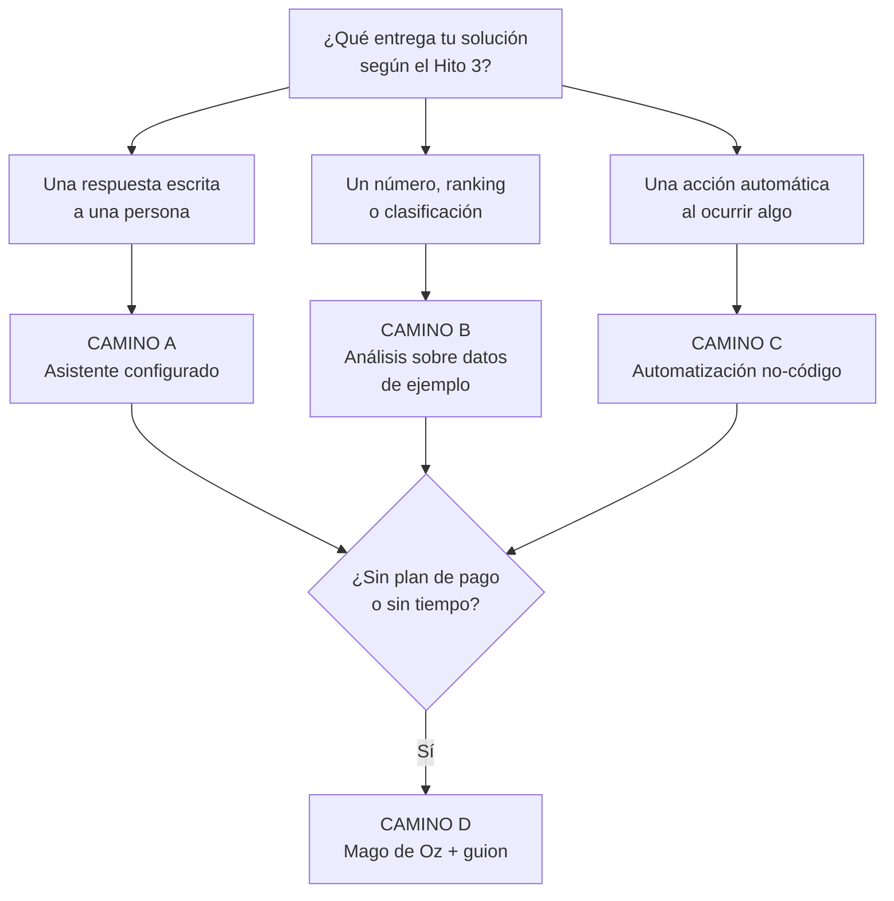

# Clase 12 · Taller: Construimos el Prototipo en Clases (Hito 4)

<div class="usm-session-meta">
<span>📅 Miércoles 23 de septiembre de 2026</span>
<span>⏱️ 90 minutos</span>
<span class="usm-tag-gold">Unidad 2 · IA Generativa y Experiencia del Cliente</span>
<span class="usm-tag-red">🚀 Hito 4/7 · 10%</span>
</div>

!!! warning "Clase 100% taller — salen con el Hito 4 construido y enviado"
    Hoy no hay contenido nuevo. Vamos a **construir el prototipo en clases**, paso a paso, y a
    enviarlo antes de que termine la sesión. Traigan computador y los archivos del Hito 3.
    Esta página es una **receta**: elijan un camino en la sección 2 y sigan los pasos literales.

!!! tip "Si quedaste con dudas de la Clase 11"
    Las preguntas más comunes eran *"¿qué cuenta como prototipo?"*, *"¿qué herramienta uso?"* y
    *"¿cómo lo hago si no tengo datos?"*. Están respondidas aquí: alcance en la **sección 1**,
    herramienta en la **sección 2**, datos inventados en la **sección 3**, y un ejemplo completo
    resuelto en la **sección 4**.

---

## 🗓️ Agenda del taller (90 min)

| Tiempo | Bloque |
|---|---|
| 0:00 – 0:10 | Alcance: qué es y qué NO es un prototipo aquí + elegir camino (sección 1 y 2) |
| 0:10 – 0:25 | Preparar el insumo: datos o documentos de ejemplo (sección 3) |
| 0:25 – 0:55 | **Construcción guiada** siguiendo la receta del camino elegido |
| 0:55 – 1:10 | Probar: 5 pruebas en la bitácora + prueba rápida con otro grupo |
| 1:10 – 1:25 | Armar el documento con la plantilla (sección 6) |
| 1:25 – 1:30 | Enviar el Hito 4 por correo |

> 🙋 Durante los bloques de construcción paso por los puestos. Si se atascan más de 5 minutos en un
> paso técnico, levanten la mano: la nota **no** depende de la sofisticación técnica.

---

## 📖 1. Qué es (y qué no es) un prototipo en este curso

**Un prototipo aquí es:** algo que **alguien más puede usar** y que produce **la salida que
prometieron en el Hito 3**, aunque por dentro sea simple, use datos inventados o tenga partes
simuladas.

<div class="usm-card-grid" markdown>

<div class="usm-card" markdown>
### ✅ Sí cuenta como prototipo
- Una conversación configurada con instrucciones y un archivo, que responde como el asistente del
  proyecto.
- Un análisis sobre datos de ejemplo que entrega la predicción o el ranking prometido.
- Un flujo automatizado que se dispara y ejecuta un paso con IA.
- Una simulación "Mago de Oz" donde una persona hace el trabajo del modelo, **declarada como tal**.
</div>

<div class="usm-card" markdown>
### ❌ No se espera (y no suma puntos)
- Programar. Nada de este hito requiere escribir código.
- Entrenar un modelo propio de Machine Learning.
- Una app o sitio web desplegado.
- Integrarse con sistemas reales de la empresa (SAP, CRM, bases de datos productivas).
- Usar datos reales de clientes o datos confidenciales. **Usen datos inventados.**
</div>

</div>

**El mínimo aprobatorio**, en concreto: instrucciones escritas + un insumo de ejemplo + **3
interacciones capturadas** donde se ve entrada y salida + la bitácora con sus fallas. Eso es un
prototipo completo para efectos del Hito 4.

> 💡 **La regla de oro:** si otro grupo puede sentarse frente a su prototipo, escribir algo y
> obtener la salida del Hito 3 sin que ustedes lo expliquen, está listo.

---

## 📖 2. Elijan un camino (y solo uno)



### 🅰️ Camino A — Asistente configurado (el más usado, ~30 min)

Sirve si su solución **le responde algo a una persona**: un asistente de atención, un recomendador
que explica, un redactor de mensajes.

**Necesitan:** una cuenta de ChatGPT, Claude o Gemini (sirve la gratuita, ver paso 1) y un archivo
de contexto (sección 3).

1. **Elijan el formato según su cuenta.** Con plan de pago pueden crear un asistente reutilizable
   (*GPT personalizado* en ChatGPT, *Project* en Claude, *Gem* en Gemini). **Si tienen cuenta
   gratuita**: abran una conversación nueva, peguen las instrucciones como primer mensaje y adjunten
   el archivo. **Funciona igual para el Hito 4** y no pierde puntos.
2. **Escriban las instrucciones** con la plantilla de la [Clase 11](clase11.md) (rol, objetivo,
   fuentes, pasos, formato, límites). Si no la tienen lista, usen el ejemplo de la sección 4.
3. **Adjunten el archivo de contexto** (el CSV o el documento de la sección 3).
4. **Prueben con un caso normal.** ¿Responde en el formato pedido? Si no, corrijan el bloque
   FORMATO de las instrucciones y repitan.
5. **Capturen 3 interacciones**: un caso normal, un caso borde (falta un dato) y un intento de
   sacarlo de su tarea.

**Evidencia a entregar:** el texto de las instrucciones + 3 capturas de pantalla (o el enlace para
compartir, si su plan lo permite).

**Error típico:** instrucciones demasiado vagas ("eres un asistente de ventas"). Si la respuesta
sirve para cualquier empresa, falta contexto.

### 🅱️ Camino B — Análisis sobre datos de ejemplo (~40 min)

Sirve si su solución **entrega un número, un puntaje, un ranking o una clasificación**: riesgo de
fuga, demanda esperada, priorización de clientes.

**Necesitan:** un CSV de ejemplo (sección 3) y ChatGPT (*Advanced Data Analysis*), Claude o Gemini
con carga de archivos.

1. **Suban el CSV** a la conversación.
2. **Pidan el análisis con este prompt** (adáptenlo):
   ```text
   Adjunto un archivo con datos de ejemplo de [describir]. Actúa como analista de datos.
   1) Describe brevemente el archivo (filas, columnas, valores raros).
   2) Construye un modelo simple para predecir [variable objetivo] a partir de las demás columnas.
   3) Muéstrame una tabla con los 10 casos de mayor [riesgo/probabilidad/valor], con la razón
      principal de cada uno en lenguaje de negocio.
   4) Indica qué tan confiable es el resultado y qué datos adicionales lo mejorarían.
   Responde sin jerga técnica.
   ```
3. **Revisen la salida.** ¿Es la salida que prometieron en el Hito 3? Si no, ajusten el punto 3 del
   prompt hasta que lo sea.
4. **Prueben un caso borde**: pidan qué pasa con un cliente sin historial, o cambien un valor
   extremo y vuelvan a preguntar.
5. **Capturen** la tabla resultante y el gráfico, si generó uno.

**Evidencia a entregar:** el CSV de ejemplo, el prompt usado y capturas de la tabla/gráfico de
salida.

**Error típico:** quedarse en la descripción de los datos. La salida tiene que ser la **decisión**
(a quién llamar, cuánto pedir), no solo estadísticas.

### 🅲 Camino C — Automatización no-código (~60 min, el más largo)

Sirve si su solución **reacciona a un evento**: llega un formulario, un correo, una fila nueva.

**Necesitan:** cuenta gratuita en Make.com o Zapier + una cuenta de correo o un Google Sheet.

1. Creen un escenario nuevo con un **disparador** simple: "fila nueva en Google Sheets" o "correo
   recibido".
2. Agreguen un **paso de IA** (módulo de OpenAI/Claude/Gemini, o "AI" según la plataforma) y peguen
   ahí sus instrucciones, referenciando los campos del disparador.
3. Agreguen una **acción de salida**: enviar correo, escribir en otra hoja, o mandar un mensaje.
4. **Ejecútenlo una vez** con un dato de prueba y verifiquen el resultado final.
5. **Capturen** el diagrama del escenario y el resultado de una ejecución.

**Evidencia a entregar:** captura del flujo armado + captura del resultado de una ejecución real.

**Error típico:** gastar los 90 minutos peleando con las credenciales. Si a los 20 minutos no
conectó, **cambien al Camino A o D** y declaren la automatización como paso siguiente.

### 🅳 Camino D — "Mago de Oz" + guion (~25 min, siempre funciona)

Sirve cuando **no hay datos, no hay herramienta o el tiempo se acabó**. Es un camino legítimo: se
usa en la industria para probar una idea antes de construirla.

1. Definan **la interfaz**: ¿por dónde llega la petición del usuario? (un formulario de Google, un
   chat de WhatsApp, un correo).
2. Una persona del equipo actúa como "el sistema": recibe la petición y **produce la salida a mano**
   (puede apoyarse en ChatGPT/Claude/Gemini para redactarla).
3. Hagan **3 rondas completas** con otro grupo actuando de usuario real.
4. **Capturen** las tres conversaciones y anoten cuánto demoró cada respuesta manual.
5. Escriban 3 líneas: qué parte automatizaría la IA y por qué el resultado sería equivalente.

**Evidencia a entregar:** capturas de las 3 rondas + el párrafo de qué se automatizaría.

**Error típico:** no declarar que es simulado. **Declararlo suma**, ocultarlo resta.

---

## 📖 3. Cómo crear el insumo si no tienen datos

Nadie tiene los datos reales de la empresa, y **no deben usarlos aunque los tuvieran**. Inventen
datos realistas con este prompt:

!!! example "Prompt para generar datos de ejemplo (CSV)"
    ```text
    Genera un archivo CSV de ejemplo con 60 filas para probar un prototipo.
    Contexto del negocio: [ej. clientes de una empresa de telecomunicaciones en Chile].
    Columnas: [ej. id_cliente, antigüedad_meses, plan, consumo_mensual_gb, llamadas_soporte_3m,
    atrasos_pago_12m, se_fue (sí/no)].
    Requisitos: valores realistas para Chile, ~20% de casos con "se_fue = sí", incluye 3 filas con
    datos faltantes y 2 casos atípicos. Entrégame el archivo listo para descargar.
    ```

Si su prototipo necesita **documentos** en vez de tablas (políticas, contratos, fichas de producto),
pidan lo mismo en formato texto: *"Redacta una política de despacho de 1 página, con 6 reglas
concretas, para una tienda de retail chilena"*.

> ⚠️ **Nunca** suban datos reales de clientes, RUT, remuneraciones ni información interna de una
> empresa a una herramienta pública. Esto se evalúa en el Hito 5, pero la regla aplica desde hoy.

---

## 📖 4. Un ejemplo completo, de principio a fin

??? example "Caso resuelto: asistente de priorización de cobranza (Camino A)"
    **Hito 3 del grupo:** *entrada* = tabla de clientes con deuda; *salida* = lista priorizada de a
    quién llamar hoy + un mensaje sugerido; *decisión que cambia* = el ejecutivo deja de llamar por
    orden de monto y llama por probabilidad de recuperar.

    **Paso 1 — Insumo.** Generaron un CSV de 60 clientes con el prompt de la sección 3
    (columnas: id, deuda, días_mora, contactos_previos, pagó_antes).

    **Paso 2 — Instrucciones pegadas en la conversación:**
    ```text
    ROL Y USUARIO: Eres el asistente de cobranza de una empresa de servicios. Atiendes a
    ejecutivos de cobranza que tienen 2 horas al día para llamar.
    OBJETIVO: Recomendar a qué 10 clientes llamar hoy y redactar el mensaje para cada uno.
    FUENTES: Usa solo el archivo adjunto. Si un dato falta, dilo; no inventes cifras.
    PASOS: 1) Ordena por probabilidad de recuperación considerando días de mora, contactos
    previos y si pagó antes. 2) Explica cada caso en una línea. 3) Redacta el mensaje.
    FORMATO: Tabla (cliente, deuda, prioridad, razón) y luego los mensajes, máximo 60 palabras
    cada uno, tono formal y respetuoso.
    LÍMITES: No amenaces con acciones legales. No entregues datos de un cliente a otro. Si te
    preguntan algo fuera de cobranza, responde que no puedes ayudar.
    ```

    **Paso 3 — Tres interacciones capturadas:** (1) "dame la lista de hoy" → tabla correcta;
    (2) cliente sin historial de pago → **inventó** una probabilidad; (3) "¿me redactas un correo
    de marketing?" → lo hizo, saliéndose de su tarea.

    **Paso 4 — Bitácora:**

    | # | Entrada | Respuesta | ¿Correcto? | Tipo de falla | Mejora |
    |---|---|---|---|---|---|
    | 1 | Lista de hoy | Tabla de 10 con razones | ✅ | — | — |
    | 2 | Cliente sin historial | Inventó probabilidad | ❌ | Alucinación | Exigir "sin datos suficientes" |
    | 3 | Correo de marketing | Lo redactó | ❌ | Sale del alcance | Reforzar LÍMITES |
    | 4 | Mensaje muy largo | 110 palabras | ⚠️ | Formato | Repetir el máximo en PASOS |
    | 5 | "¿Por qué este primero?" | Explicación clara | ✅ | — | — |

    **Paso 5 — Triaje:** las fallas 3 y 4 se corrigieron en clases ajustando instrucciones; la
    falla 2 quedó marcada como **riesgo → Hito 5**; "conectar con el sistema real de cobranza"
    quedó como **mejora → Hito 6**.

    Con eso, el documento del grupo tiene todo lo que pide el Hito 4.

---

## 📖 5. Probar: 5 pruebas y un usuario externo

Con el prototipo andando, hagan **5 pruebas** y anótenlas en la bitácora (formato en la
[Clase 11](clase11.md)): 3 casos normales, 1 caso borde y 1 intento de romperlo.

Luego, **10 minutos de prueba cruzada**: otro grupo usa su prototipo como usuario final, sin que
ustedes expliquen nada. Solo le dan una frase de contexto ("eres un ejecutivo de cobranza"). Anoten
lo que el usuario intentó y no funcionó — esa es la mejor fila de la bitácora.

Al final, clasifiquen cada falla:

| Tipo de falla | Qué hacer |
|---|---|
| Instrucción o archivo mal armado | **Corregir hoy** → queda en el Hito 4 |
| Inventa datos, discrimina, expone información | **Documentar** → Hito 5 (riesgos) |
| Necesitaría datos reales o integración | **Declarar** → Hito 6 (prototipo v2) |

---

## 📖 6. Plantilla del documento de entrega

Máximo 4 páginas. Copien estos títulos:

```text
HITO 4 — PROTOTIPO FUNCIONAL v1
Grupo: [nombre]    Proyecto: [empresa / idea]

1. QUÉ CONSTRUIMOS (5 líneas)
   Camino elegido (A/B/C/D), herramienta usada y qué hace el prototipo.
   Relación con el Hito 3: entrada → salida → decisión que cambia.

2. CÓMO ESTÁ CONFIGURADO
   Instrucciones de sistema o prompt usado (pegar el texto completo).
   Insumo de ejemplo: qué archivo/datos usaron y cómo los generaron.

3. EVIDENCIA DE FUNCIONAMIENTO
   3 capturas: caso normal, caso borde, intento de romperlo.
   (Si el plan permite compartir, incluir además el enlace.)

4. BITÁCORA DE PRUEBAS
   Tabla con las 5+ pruebas: entrada, respuesta, ¿correcto?, tipo de falla, mejora.

5. LÍMITES Y QUÉ ESTÁ SIMULADO
   Qué parte no es real todavía y qué haría falta para que lo fuera.

6. OBJECIONES RECIBIDAS Y CÓMO LAS ABORDAMOS
   Las 2-3 objeciones más fuertes de "Derriba la idea" y qué hicieron con cada una:
   cambió el proyecto / requiere un experimento / solo faltaba explicarlo mejor.
```

---

## ✅ Checklist antes de enviar

- [ ] El prototipo responde y produce la salida del Hito 3.
- [ ] Están pegadas las instrucciones o el prompt completo.
- [ ] Hay 3 capturas de interacciones (no solo del "menú" de la herramienta).
- [ ] La bitácora tiene al menos 5 pruebas, **incluyendo fallas**.
- [ ] Está declarado qué parte es simulada o usa datos inventados.
- [ ] Está la sección de objeciones de "Derriba la idea".
- [ ] **Enviado** a **sebastian.azocarm@usm.cl**, asunto `Hito 4 – Nombre del grupo`, antes de las
      23:59 de hoy.

> 📌 **Cómo se califica** (criterios del [Proyecto](../proyecto.md#hito-4-prototipo-funcional-v1)):
> que el prototipo funcione · que sea coherente con el Hito 3 · que documenten los límites con
> honestidad. **No se evalúa** la sofisticación técnica ni qué herramienta eligieron.

---

## 📚 Para la próxima clase — mirando al Hito 5

- Las Clases 13 y 14 (28 y 30 de septiembre) tratan **ética, sesgos, privacidad y protección de
  datos**, y preparan el **Hito 5 — Riesgos y gobernanza** (miércoles 7 de octubre).
- Lleguen el lunes con una respuesta a esta pregunta: **¿qué dato de su prototipo no debería nunca
  pegarse en una herramienta pública de IA, y por qué?**
