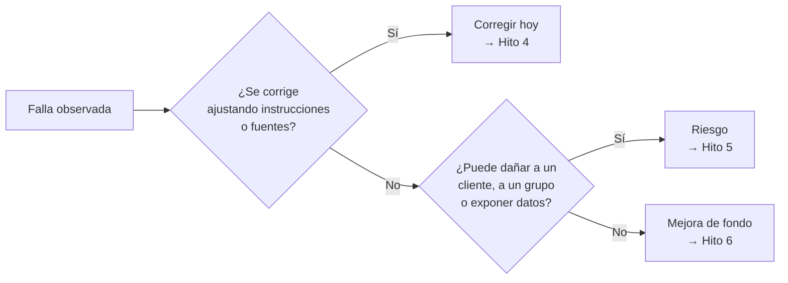

# Clase 12 · Taller de Prototipado — Prueba de Usuario y Entrega del Hito 4

📅 Miércoles 23 de septiembre de 2026
⏱️ 90 minutos
Unidad 2 · IA Generativa y Experiencia del Cliente
🚀 Hito 4/7 · 10%

!!! warning "Día de entregable"
    Hoy se entrega el **Hito 4 — Prototipo funcional v1**. La clase es un taller: cada grupo pone su
    prototipo en manos de otro grupo que lo usa como si fuera el cliente real, registra lo que falla,
    y con eso cierran la entrega. Envío por correo antes de las 23:59.

## 🎯 Objetivos de la sesión

- Probar el prototipo con usuarios que **no lo construyeron**, y observar dónde falla.
- Distinguir fallas que se corrigen hoy de fallas que son riesgos (Hito 5) o mejoras de fondo
  (Hito 6).
- Entregar el **Hito 4** con evidencia de funcionamiento, limitaciones honestas y respuesta a las
  objeciones de "Derriba la idea".

*Resultado de aprendizaje asociado: **CTS6 · RDA 3.2** — Implementa un dominio avanzado de
plataformas y programas, evaluando procedimientos y técnicas innovadoras.*

---

## 🗓️ Agenda (90 min)

| Tiempo | Bloque |
|---|---|
| 0:00 – 0:10 | Checklist del Hito 4 y cómo se evaluará |
| 0:10 – 0:30 | Últimos ajustes al prototipo (en grupo) |
| 0:30 – 0:55 | Prueba de usuario cruzada: dos rondas de 12 minutos |
| 0:55 – 1:10 | Triaje de fallas: ¿se arregla hoy, es un riesgo o es una mejora? |
| 1:10 – 1:25 | Cierre del documento y envío del Hito 4 |
| 1:25 – 1:30 | Qué viene: ética y riesgos (Hito 5) |

---

## 📖 Contenidos

### 1. Checklist del Hito 4

Revisen que su entrega tenga todo lo que pide el
[Hito 4 en la página del Proyecto](../proyecto.md#hito-4-prototipo-funcional-v1):

- [ ] **Prototipo que funciona** (GPT, Project, Gem, automatización o análisis con datos de ejemplo).
- [ ] **Evidencia:** enlace compartible, o capturas de 2-3 interacciones completas.
- [ ] **Configuración:** las instrucciones de sistema usadas (pueden ir en un anexo).
- [ ] **Limitaciones detectadas:** la bitácora de pruebas de la [Clase 11](clase11.md), resumida.
- [ ] **Qué está simulado:** si alguna parte es "Mago de Oz" o usa datos inventados, decirlo.
- [ ] **Objeciones recibidas y cómo las abordamos:** las 2-3 más relevantes de
      ["Derriba la idea"](clase10.md), y qué hicieron con cada una.

**Cómo se evaluará** (criterios publicados en el Proyecto):

| Criterio | Qué se mira |
|---|---|
| El prototipo efectivamente funciona | Se puede usar y produce la salida prometida en el Hito 3 |
| Coherencia con el Hito 3 | La entrada, la salida y el flujo son los que especificaron |
| Honestidad al documentar límites | La bitácora muestra fallas reales, no solo casos que salieron bien |

> 💡 Un prototipo que falla en 2 de 5 pruebas **y lo documenta bien** vale más que uno que "funciona
> perfecto" sin evidencia. Documentar fallas es parte del trabajo, no una admisión de derrota.

### 2. Prueba de usuario cruzada

Cada grupo prueba el prototipo de otro grupo **actuando como el usuario final** (el cliente, el
ejecutivo, el operador). Dos rondas de 12 minutos, rotando parejas de grupos.

**Reglas para el grupo que prueba:**

1. Lean solo el contexto mínimo que les da el otro grupo (una frase: "eres un ejecutivo de cobranza
   y quieres saber a quién llamar hoy"). No miren las instrucciones de sistema.
2. Hagan al menos **4 intentos**: 2 normales, 1 caso borde y 1 intento de sacarlo de su tarea.
3. Anoten cada intento en la bitácora del **otro** grupo: qué pidieron, qué obtuvieron y si les
   sirvió.

**Reglas para el grupo dueño del prototipo:**

- Miren sin intervenir. No expliquen cómo "debería" usarse — si el usuario se confunde, eso es un
  hallazgo.
- Anoten las preguntas que el usuario hizo y que no esperaban.

Preguntas de cierre para el usuario (2 minutos):

- ¿Usarías esto en tu trabajo real? ¿Qué te haría confiar en la respuesta?
- ¿En qué momento dudaste de lo que te respondió?
- Si le quitaras la IA, ¿qué perderías?

### 3. Triaje: ¿qué hacemos con cada falla?

No todas las fallas se resuelven igual ni en el mismo hito:

| Tipo de falla | Ejemplo | ¿Qué hacer? | ¿Dónde va? |
|---|---|---|---|
| **Instrucción débil** | No respeta el formato, responde fuera de tema | Ajustar instrucciones de sistema hoy | Hito 4 (corregida) |
| **Dato faltante o mal cargado** | No encuentra la política que sí existe | Reordenar o limpiar las fuentes hoy | Hito 4 (corregida) |
| **Riesgo** | Inventa cifras, trata distinto a un grupo, expone datos | Documentar ahora, mitigar después | **Hito 5** — Riesgos y gobernanza |
| **Limitación de fondo** | Necesitaría datos reales o integración con un sistema | Declararla y planificarla | **Hito 6** — Prototipo v2 |
| **Duda de valor** | El usuario no ve para qué le sirve | Revisar propuesta de valor | Hito 6 y Hito 7 (viabilidad) |

---

## ✏️ Taller: cierre y entrega del Hito 4

1. Hagan el triaje de todas las fallas de su bitácora (las propias y las de la prueba cruzada).
2. Corrijan hoy las que son de instrucciones o fuentes, y vuelvan a probar esos casos.
3. Marquen en la bitácora cuáles quedan como **riesgo (Hito 5)** y cuáles como **mejora (Hito 6)**.
4. Completen el checklist de la sección 1.
5. **Envíen el Hito 4** por correo a **sebastian.azocarm@usm.cl**, con el asunto
   `Hito 4 – Nombre del grupo`, antes de las 23:59 de hoy.

---

## 📚 Para la próxima clase — mirando al Hito 5

- Las Clases 13 y 14 (28 y 30 de septiembre) tratan **ética, sesgos algorítmicos, privacidad y
  protección de datos**, y preparan el **Hito 5 — Riesgos y gobernanza** (miércoles 7 de octubre).
- Guarden la bitácora con las fallas marcadas como "riesgo": serán el punto de partida del Hito 5.
- Reflexionen sobre una pregunta para el lunes: **¿qué dato de su prototipo no debería nunca
  pegarse en una herramienta pública de IA, y por qué?**
