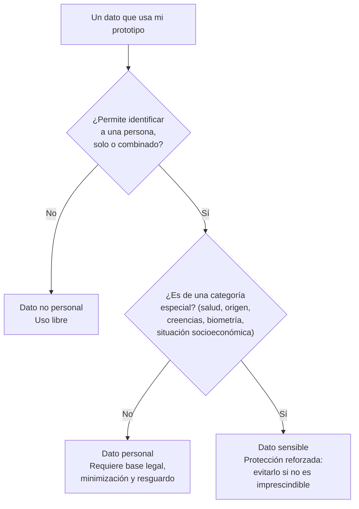

# Clase 14 · Privacidad, Protección de Datos y Transparencia

📅 Miércoles 30 de septiembre de 2026
⏱️ 90 minutos
Unidad 3 · Ética, Riesgos y Gobernanza de la IA

!!! note "Sesión formativa (sin hito) — cierra la preparación del Hito 5"
    No hay entrega evaluada hoy. Esta clase completa lo que empezó la [Clase 13](clase13.md) y
    termina con la **plantilla del Hito 5** llena a medias: lo que salga de aquí se pule en el
    taller de la Clase 15 y se entrega el **miércoles 7 de octubre**.

## 🎯 Objetivos de la sesión

- Clasificar los datos que usa su prototipo según qué tan sensibles son, y qué se puede hacer con cada tipo.
- Conocer el marco legal chileno de protección de datos personales, en términos prácticos para un rol comercial.
- Aplicar minimización de datos: usar lo mínimo necesario en vez de todo lo disponible.
- Distinguir **transparencia** (decir que hay IA) de **explicabilidad** (poder decir por qué decidió así).
- Completar la plantilla de riesgos y mitigaciones del Hito 5.

*Resultado de aprendizaje asociado: **CTS6 · RDA 3.2** — Implementa un dominio avanzado de
plataformas y programas, evaluando procedimientos y técnicas innovadoras.*

---

## 🗓️ Agenda (90 min)

| Tiempo | Bloque |
|---|---|
| 0:00 – 0:10 | Puesta en común: hallazgos de la auditoría de sesgo |
| 0:10 – 0:30 | Qué es un dato personal · marco legal en Chile, en simple |
| 0:30 – 0:45 | Minimización, anonimización y el error de "subir todo al chat" |
| 0:45 – 1:05 | Transparencia y explicabilidad: qué le debemos decir al usuario |
| 1:05 – 1:25 | **Taller: plantilla de riesgos y mitigaciones del Hito 5** |
| 1:25 – 1:30 | Cierre y vínculo con la Clase 15 (taller de riesgos) |

---

## 📖 Contenidos

### 1. Clasifiquen sus datos antes de decidir nada

> ⚠️ **Combinado cuenta.** Comuna + edad + rubro puede identificar a una persona aunque ningún campo
> lo haga por separado. Si su prototipo cruza tablas, revisen el resultado del cruce, no las tablas
> de entrada.

### 2. El marco legal chileno, en lo que les sirve

| | En simple |
|---|---|
| **Ley 19.628** | La ley histórica de protección de la vida privada: trata el tratamiento de datos personales y exige consentimiento o una fuente legal que lo autorice. |
| **Ley 21.719 (2024)** | Moderniza el régimen, alinea a Chile con estándares tipo GDPR, crea una **Agencia de Protección de Datos Personales** y establece sanciones. Su entrada en vigencia es diferida, así que revisen el estado vigente al momento de implementar. |
| **GDPR (Unión Europea)** | Referencia internacional. Importa si la empresa trata datos de residentes en la UE. |

Tres ideas que se aplican casi siempre, independiente de la letra fina:

1. **Finalidad:** los datos se recogen para algo declarado, y usarlos para otra cosa requiere justificarlo.
2. **Proporcionalidad:** pedir solo lo necesario para esa finalidad.
3. **Derechos de la persona:** saber qué se sabe de ella, corregirlo y, en ciertos casos, oponerse.

!!! warning "Esto no es asesoría legal"
    El objetivo del curso es que sepan **reconocer cuándo hay un problema y a quién preguntarle**,
    no que actúen como abogados. En una empresa, esa conversación es con el área legal o de
    cumplimiento — y llegar a ella con el riesgo ya identificado es exactamente lo que se espera de
    un rol comercial.

### 3. Minimización: el prototipo también se diseña con menos

| En vez de… | Usen… | Por qué |
|---|---|---|
| RUT del cliente | Un identificador interno sin significado | El modelo no necesita saber quién es, solo distinguirlo |
| Fecha de nacimiento | Tramo etario | Igual de útil, mucho menos identificable |
| Dirección exacta | Comuna, o distancia a la sucursal | Menos riesgo y menos proxy directo |
| Texto libre completo del cliente | Solo el campo que se va a analizar | Reduce la superficie de exposición |

Y la regla que ya venimos repitiendo desde la Clase 1: **nunca peguen datos reales de clientes en
una herramienta pública de IA**. Para el prototipo del curso, datos sintéticos.

### 4. Transparencia ≠ explicabilidad

| | Qué significa | Pregunta que responde |
|---|---|---|
| **Transparencia** | Decirle a la persona que está interactuando con un sistema de IA y para qué se usan sus datos | "¿Sé que esto es una IA?" |
| **Explicabilidad** | Poder decir por qué el sistema entregó ese resultado en ese caso | "¿Por qué me rechazaron?" |

Un sistema puede ser transparente y nada explicable, y ahí está el problema: si su prototipo entrega
una decisión que afecta a alguien, esa persona tiene derecho a una razón comprensible. Modelos
simples la dan naturalmente; los complejos requieren trabajo extra o una alternativa interpretable.

> 💡 **Para el proyecto:** decidan quién queda **a cargo de la decisión final**. Un sistema que
> *recomienda* a una persona que decide es muy distinto —legal y éticamente— de uno que decide solo.
> Esa frase debe estar en su Hito 5.

---

## ✏️ Taller: plantilla de riesgos del Hito 5

*Lo que completen hoy es el borrador de la entrega del 7 de octubre.*

Con la tabla de sesgo de la Clase 13 y su prototipo abierto, completen:

**A. Clasificación de datos**

| Dato que usa el prototipo | ¿Personal? | ¿Sensible? | ¿Se puede minimizar? | Decisión |
|---|---|---|---|---|
| | | | | |

**B. Riesgos y mitigaciones** *(mínimo dos riesgos, como pide el [Hito 5](../proyecto.md#hito-5-riesgos-y-gobernanza))*

| # | Riesgo | Tipo (sesgo / privacidad / alucinación / dependencia) | A quién afecta | Mitigación **concreta** | ¿Implementable en el Hito 6? |
|---:|---|---|---|---|---|
| 1 | | | | | |
| 2 | | | | | |

**C. Gobernanza en una frase**

> *"En nuestro proyecto, la decisión final la toma __________, con apoyo del sistema. Si el sistema
> se equivoca, la persona afectada puede __________."*

!!! tip "Qué distingue una mitigación buena de una genérica"
    ❌ "Revisaremos periódicamente el modelo para evitar sesgos."
    ✅ "Antes de cada campaña, comparamos la tasa de recomendación entre comunas de alto y bajo
    ingreso; si difiere más de 10 puntos, la campaña no sale hasta revisarla."
    La segunda es verificable: dice **quién**, **cuándo**, **con qué umbral** y **qué pasa si falla**.

---

## 📚 Para la próxima clase

- La Clase 15 (lunes 5 de octubre) es el **taller de revisión de riesgos**: se pulen estas tablas con
  retroalimentación cruzada entre grupos.
- El **Hito 5** se entrega el miércoles 7 de octubre — ver [Proyecto](../proyecto.md#hito-5-riesgos-y-gobernanza).
- Traigan la plantilla de hoy completa al menos en la sección A y con dos riesgos identificados.
