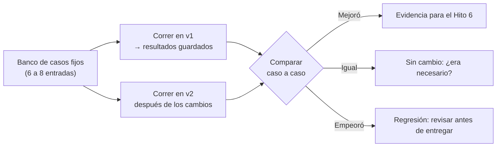

# Clase 16 · Taller de Prototipado (2) — Mejoras y Prueba de Regresión

<div class="usm-session-meta">
<span>📅 Miércoles 14 de octubre de 2026</span>
<span>⏱️ 90 minutos</span>
<span class="usm-tag-gold">Unidad 3 · Taller de Prototipado de Negocios con IA</span>
<span class="usm-tag-red">🚀 Hito 6B · 3% · se entrega en clases</span>
</div>

!!! danger "Entrega en clases: solo se evalúa lo enviado hoy entre 17:30 y 19:00"
    El **Hito 6** se construye en **tres avances entregados en clases** (6A el 7 de octubre, 6B hoy,
    6C el 19), y la suma de los tres es el hito completo. Hoy corresponde el **Hito 6B — Mejoras y
    comparación v1 vs. v2 (3%)**.

    **Los correos recibidos fuera del horario de clases no se evalúan** y el avance queda con 0.
    El avance C se entrega el lunes 19 en la [Clase 17](clase17.md).

## 🎯 Objetivos de la sesión

- Implementar las mejoras pendientes de la bitácora del Hito 4.
- Construir una **prueba de regresión**: un conjunto fijo de casos que se ejecuta igual en cada versión.
- Comparar v1 y v2 sobre los mismos casos y producir la tabla de evidencia del Hito 6.
- Detectar **regresiones**: lo que se arregló por un lado y se rompió por otro.

*Resultado de aprendizaje asociado: **CTS6 · RDA 3.2** — Implementa un dominio avanzado de
plataformas y programas, evaluando procedimientos y técnicas innovadoras.*

---

## 🗓️ Agenda (90 min)

| Tiempo | Bloque |
|---|---|
| 0:00 – 0:10 | Qué quedó implementado la semana pasada: ronda rápida por grupo |
| 0:10 – 0:25 | Qué es una prueba de regresión y por qué un prototipo de IA la necesita |
| 0:25 – 0:40 | Armar el set de casos fijos (el "banco de pruebas" del proyecto) |
| 0:40 – 1:12 | **Taller: implementar mejoras y correr la comparación v1 vs. v2** |
| 1:12 – 1:22 | Lectura de resultados y regresiones detectadas |
| 1:22 – 1:28 | **Envío del Hito 6A** (correo desde la sala, antes de las 19:00) |
| 1:28 – 1:30 | Cierre |

---

## 📖 Contenidos

### 1. Por qué un prototipo de IA necesita prueba de regresión

Cuando corrigen un prompt, no corrigen una línea aislada: cambian el comportamiento del asistente
**en todos los casos a la vez**. Es habitual arreglar la alucinación y, sin notarlo, volver las
respuestas tan cautas que el prototipo deja de servir.

Una **prueba de regresión** es la defensa contra eso: un conjunto fijo de casos que se ejecuta igual
antes y después de cada cambio.



### 2. Cómo armar el banco de casos

Entre 6 y 8 casos, fijos y escritos textualmente, para poder repetirlos sin ambigüedad:

| Tipo de caso | Cuántos | De dónde sale |
|---|---:|---|
| **Normales** | 3 | Uso esperado del prototipo |
| **Borde** | 2 | Dato faltante, cliente atípico, valor extremo |
| **Adversarios** | 1-2 | Intento de sacarlo de su tarea, pregunta fuera de alcance |
| **De riesgo** | 1-2 | El caso del sesgo o la privacidad del Hito 5 (ej. la prueba del par) |

> ⚠️ Los casos se escriben **una vez** y no se cambian entre versiones. Si cambian la pregunta, la
> comparación deja de significar algo.

### 3. La tabla de comparación: el corazón del Hito 6

| # | Caso (entrada textual) | Resultado v1 | Resultado v2 | Veredicto |
|---:|---|---|---|---|
| 1 | "¿A quién llamo hoy?" | Lista de 10 con razones | Igual, con fuente citada | ✅ Mejora |
| 2 | Cliente sin historial | Inventó un puntaje | "Sin datos suficientes" | ✅ Mejora |
| 3 | Pregunta fuera de tema | Respondió igual | Rechaza y redirige | ✅ Mejora |
| 4 | Caso del par (comuna A vs. B) | Recomendaciones distintas | Iguales | ✅ Mitigación efectiva |
| 5 | Caso normal con dato parcial | Respondía con supuestos | Ahora pide el dato faltante | ⚠️ Revisar: ¿quedó demasiado estricto? |

La fila 5 es el tipo de hallazgo que más valor tiene: una corrección que se pasó de cautelosa. El
Hito 6 valora que lo detecten y lo digan, no que todas las filas digan "mejora".

### 4. Cuando una mejora rompe otra cosa

Tres compensaciones habituales al endurecer un prototipo:

| Al corregir… | Suele aparecer… | Cómo equilibrar |
|---|---|---|
| Alucinaciones (exigir fuentes) | Responde "no tengo ese dato" demasiado seguido | Permitir responder con lo que sí hay, marcando lo que falta |
| Salidas fuera de alcance (límites duros) | Rechaza preguntas legítimas vecinas | Listar ejemplos de lo que **sí** está dentro del alcance |
| Sesgo (quitar variables) | Pierde capacidad de recomendar bien | Mantener la variable y controlar el resultado, en vez de ocultarla |

---

## ✏️ Taller y entrega del Hito 6A

*Esto **sí** se entrega hoy, antes de las 19:00. Vale el 3% de la nota final.*

1. **Escriban el banco de casos** (6-8), con la mezcla de la sección 2. Déjenlo en un documento aparte.
2. **Corran los casos en el prototipo actual** si aún no lo habían hecho, y guarden los resultados
   como "v1".
3. **Implementen las mejoras pendientes** del backlog de la Clase 15.
4. **Vuelvan a correr los mismos casos** y registren los resultados como "v2".
5. **Completen la tabla de comparación** y marquen explícitamente cualquier regresión.
6. Anoten lo que queda pendiente para la Clase 17.

### 📤 Cómo entregar el Hito 6B

- [ ] El **banco de casos** (6-8 entradas, escritas textualmente).
- [ ] La **tabla de comparación** v1 vs. v2, con el veredicto de cada fila.
- [ ] Al menos una **regresión o compensación** señalada explícitamente (o cómo verificaron que no hay).
- [ ] Máximo dos páginas; se aceptan capturas de pantalla.
- [ ] Correo a **sebastian.azocarm@usm.cl**, asunto `Hito 6B – Nombre del grupo`.
- [ ] **Enviado entre las 17:30 y las 19:00 de hoy.** Fuera de ese horario no se evalúa.

> ⚠️ Si no alcanzaron a correr los 8 casos, envíen los que sí tienen. Una comparación parcial
> entregada a tiempo se evalúa; una completa enviada mañana, no.

!!! tip "Usen el asistente para esto también"
    ```text
    Estas son las instrucciones de la versión 1 de mi asistente y estas las de la versión 2.
    Estos son los resultados de los mismos 7 casos en cada versión.
    1. Dime en qué casos mejoró, en cuáles no cambió y en cuáles empeoró.
    2. Señala si algún cambio de la v2 pudo causar el empeoramiento, y cuál.
    3. Propón el ajuste mínimo para corregirlo sin perder lo que ya mejoró.
    ```
    Después verifiquen ustedes: el asistente no es juez de su propio trabajo.

---

## 📚 Para la próxima clase

- La [Clase 17](clase17.md) (lunes 19 de octubre) cierra el prototipo v2 y ahí se entrega el
  **Hito 6C (3%)**, también durante la sesión.
- Lleguen con las regresiones de hoy identificadas: resolverlas es la mitad del trabajo del lunes.
