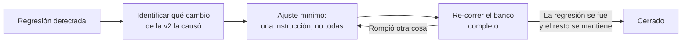

# Clase 17 · Taller de Prototipado (3) — Cierre del Prototipo v2

📅 Lunes 19 de octubre de 2026
⏱️ 90 minutos
Unidad 3 · Taller de Prototipado de Negocios con IA
🚀 Hito 6C · 3% · se entrega en clases

!!! danger "Entrega en clases: solo se evalúa lo enviado hoy entre 17:30 y 19:00"
    Hoy se cierra el **Hito 6** con su tercer y último avance: **Hito 6C — Prototipo v2 cerrado
    (3%)**. Como los avances A y B (Clases [15](clase15.md) y [16](clase16.md)), se trabaja y se
    envía **durante la sesión**.

    **Los correos recibidos fuera del horario de clases no se evalúan** y el avance queda con 0.

## 🎯 Objetivos de la sesión

- Implementar y verificar **al menos una mitigación de riesgo** del Hito 5B en el prototipo.
- Resolver las **regresiones** detectadas en el avance 6A.
- Documentar el cambio con la tabla **qué cambió / por qué / qué lo demuestra**.
- Dejar registrado lo que no se alcanzó a resolver, como insumo del Hito 7 y de la presentación final.

*Resultado de aprendizaje asociado: **CTS6 · RDA 3.2** — Implementa un dominio avanzado de
plataformas y programas, evaluando procedimientos y técnicas innovadoras.*

---

## 🗓️ Agenda (90 min)

| Tiempo | Bloque |
|---|---|
| 0:00 – 0:10 | Qué mostró la comparación del miércoles: hallazgos por grupo |
| 0:10 – 0:25 | Implementar una mitigación de riesgo y **verificarla**, no solo declararla |
| 0:25 – 0:40 | Resolver regresiones sin romper lo que ya mejoró |
| 0:40 – 1:15 | **Taller: cierre del prototipo v2 y documentación** |
| 1:15 – 1:22 | Qué queda fuera del alcance: lo que no se resolvió |
| 1:22 – 1:28 | **Envío del Hito 6B** (correo desde la sala, antes de las 19:00) |
| 1:28 – 1:30 | Cierre y vínculo con la Clase 18 (evaluación social) |

---

## 📖 Contenidos

### 1. Una mitigación no está implementada hasta que se verifica

En el Hito 5B escribieron mitigaciones. En el 6A las empezaron a aplicar. Hoy hay que cerrar el
círculo, y el círculo tiene tres partes:

| Paso | Pregunta | Evidencia |
|---|---|---|
| **Implementar** | ¿Qué cambió exactamente en el prototipo? | El texto del cambio (instrucción, campo eliminado, paso agregado) |
| **Verificar** | ¿El caso de riesgo del banco se comporta distinto ahora? | La salida antes y la salida después |
| **Acotar** | ¿En qué situaciones la mitigación **no** funciona? | Una frase honesta |

> 💡 El tercer paso es el que distingue un trabajo maduro. Toda mitigación tiene un límite; decir
> cuál es vale más que afirmar que el problema está resuelto.

### 2. Resolver regresiones sin deshacer lo ganado

Si en el 6A apareció una fila "⚠️ revisar", hoy se resuelve. El procedimiento:

La regla operativa: **un cambio a la vez, y volver a correr el banco completo después de cada uno**.
Si cambian tres cosas y el resultado empeora, no sabrán cuál fue.

### 3. La tabla de documentación del cambio

Es el entregable central de hoy. Una fila por cambio:

| Qué cambió | Por qué | Qué lo demuestra |
|---|---|---|
| Se agregó la regla "sin datos suficientes" al bloque PASOS | El prototipo inventaba un puntaje para clientes sin historial (bitácora, caso 2) | Caso 2 del banco: antes puntaje inventado, ahora la frase exacta |
| Se eliminó la comuna del archivo de entrada | Actuaba como proxy socioeconómico (Hito 5A) | Prueba del par: antes recomendaciones distintas, ahora iguales |
| Se listaron ejemplos de preguntas dentro del alcance | El endurecimiento del 6A rechazaba consultas legítimas | Caso 5: antes rechazada, ahora respondida |

### 4. Lo que no se resolvió también se entrega

Dejen escrito, en dos o tres líneas, qué quedó pendiente y por qué: falta de datos reales, límite de
la herramienta, necesidad de integración con un sistema, o tiempo. No resta puntaje — es la materia
prima de la sección de limitaciones del **Hito 7** y de la presentación final.

---

## ✏️ Taller y entrega del Hito 6B

*Esto **sí** se entrega hoy, antes de las 19:00. Vale el 3% de la nota final.*

En su grupo de proyecto:

1. **Implementen la mitigación** elegida del Hito 5B y verifíquenla con el caso de riesgo del banco.
2. **Resuelvan las regresiones** del 6A, un cambio a la vez, re-corriendo el banco después de cada uno.
3. **Completen la tabla** qué cambió / por qué / qué lo demuestra.
4. **Guarden la configuración final** del prototipo (instrucciones completas, copiadas y pegadas).
5. **Escriban lo pendiente**: dos o tres líneas sobre lo que no alcanzaron a resolver.

### 📤 Cómo entregar el Hito 6C

- [ ] Configuración final del prototipo (texto completo de las instrucciones).
- [ ] Tabla de documentación del cambio, con al menos una **mitigación verificada**.
- [ ] Evidencia del caso de riesgo: antes y después.
- [ ] Párrafo de lo que quedó pendiente.
- [ ] Máximo tres páginas; se aceptan capturas.
- [ ] Subido al **buzón del Hito 6C** (abajo), con el **nombre del grupo** escrito igual
      que en la planilla del curso.
- [ ] **Enviado entre las 17:30 y las 19:00 de hoy.** Fuera de ese horario no se evalúa.

> 📌 Con este envío queda cerrado el **Hito 6** (6A + 6B + 6C = 10%). El prototipo ya no se modifica para
> efectos de evaluación: lo que viene es evaluarlo como proyecto de negocio.

---

## 📚 Para la próxima clase

- La Clase 18 (miércoles 21 de octubre) abre la última unidad: **Evaluación Social de Iniciativas
  basadas en IA**, y con ella empieza el **Hito 7**, que también se construye en avances entregados
  en clases: 7A (21 oct), 7B (26 oct), 7C (28 oct) y 7D (2 nov).
- Traigan el párrafo de pendientes de hoy: varias de esas limitaciones son costos o supuestos que
  aparecerán en la evaluación de viabilidad.

---

## 📬 Buzón del Hito 6C

<strong>📤 Entrega aquí el Hito 6C — Prototipo v2 cerrado</strong>
Un <strong>PDF por grupo</strong>, con el nombre del grupo. El buzón <strong>se cierra a las 19:20</strong>, pero solo se evalúa lo enviado <strong>hasta las 19:00</strong>.

[📬 Abrir buzón](../entregas.md#hito-6c-3){.usm-btn}

Ver todos los buzones y las reglas de entrega en [Entregas](../entregas.md).
