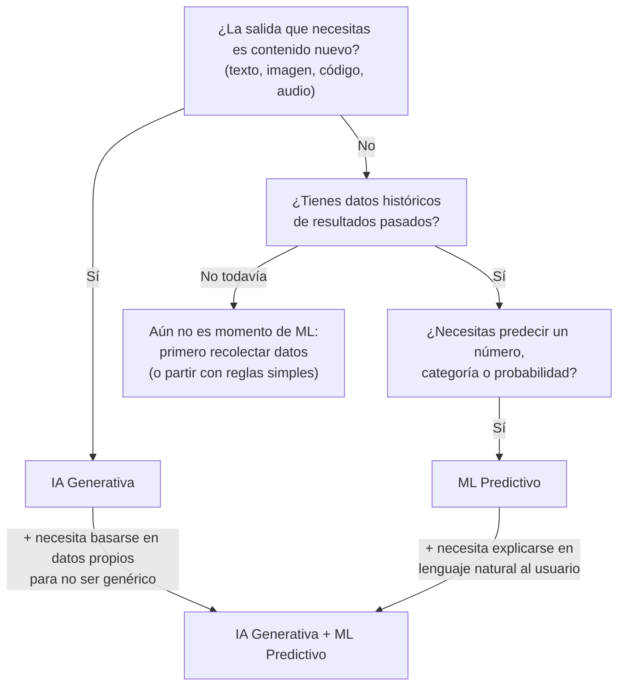
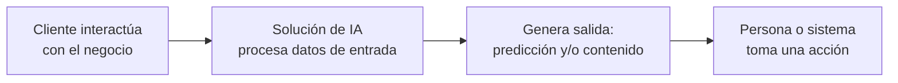

# Clase 8 · Diseñando la Solución — ¿ML Predictivo o IA Generativa?

📅 Lunes 31 de agosto de 2026
⏱️ 90 minutos
Unidad 2 · Toma de Decisiones y Automatización Inteligente

!!! note "Sesión formativa (sin hito)"
    No hay entrega evaluada hoy. Esta clase prepara directamente el **Hito 3 — Diseño de la
    solución con IA**, que se trabaja en la [Clase 9](clase9.md) (taller) y se entrega el miércoles
    2 de septiembre.

## 🎯 Objetivos de la sesión

- Repasar cuándo conviene ML predictivo, IA Generativa, o una combinación de ambos.
- Aplicar un árbol de decisión simple para elegir la tecnología correcta para un problema de negocio.
- Especificar con precisión el dato de entrada y la salida esperada de una solución de IA.
- Diseñar el flujo de cómo la solución se inserta en el proceso de negocio del proyecto.

*Resultado de aprendizaje asociado: **CTS2 · RDA 3.1** — Evalúa problemas complejos del ámbito
disciplinar, justificando los datos, variables o causas que lo determinan.*

---

## 🗓️ Agenda (90 min)

| Tiempo | Bloque |
|---|---|
| 0:00 – 0:10 | Recapitulación de la Clase 7 (escalera analítica, matriz de priorización) |
| 0:10 – 0:30 | Repaso: ML predictivo vs. IA Generativa — ¿cuándo usar cada uno? |
| 0:30 – 0:50 | Árbol de decisión: eligiendo la tecnología correcta |
| 0:50 – 1:10 | Especificando entrada, salida y el flujo de la solución |
| 1:10 – 1:25 | Actividad formativa: borrador de especificación de la solución propia |
| 1:25 – 1:30 | Cierre y vínculo con la Clase 9 (taller + entrega del Hito 3) |

---

## 📖 Contenidos

### 1. Repaso: ML predictivo vs. IA Generativa

Retomando la Clase 1 y 2: **ML predictivo** produce un número, una categoría o una probabilidad
(un *scoring*, una predicción de demanda). **IA Generativa** produce contenido nuevo (texto,
imagen, código, audio). Muchas soluciones reales combinan ambos: un modelo predictivo decide *qué*
recomendar, y un modelo generativo decide *cómo comunicarlo*.

### 2. Árbol de decisión: eligiendo la tecnología correcta

!!! example "Ejemplo aplicado"
    Un asistente que recomienda productos a un cliente y **además** redacta un mensaje
    personalizado explicando por qué se los recomienda combina **ML predictivo** (qué recomendar)
    con **IA Generativa** (cómo redactarlo) — el nodo final del árbol.

### 3. Especificando entrada, salida y flujo

Toda solución de IA bien especificada responde tres preguntas concretas — exactamente lo que pide
el Hito 3:

| Pregunta | Ejemplo |
|---|---|
| **¿Qué dato de entrada usa?** | Historial de compras del cliente de los últimos 12 meses |
| **¿Qué salida entrega?** | Una lista de 3 productos recomendados + un mensaje personalizado |
| **¿Cómo se inserta en el proceso de negocio?** | Se activa cuando el cliente abre la app; la recomendación aparece en la pantalla principal |

Un flujo simple ayuda a comunicar esto sin necesidad de diagramas técnicos complejos:

> 💡 **Para el Hito 3:** no necesitan un diagrama técnico perfecto — un dibujo a mano fotografiado
> con estas 4 cajas (cliente/proceso → solución de IA → salida → acción) es suficiente y es
> exactamente lo que pide el Hito 3.

---

## ✏️ Actividad formativa: especificación borrador de la solución

*No se entrega ni se califica. Es la base directa del Hito 3, que se consolida en la Clase 9.*

En su grupo de proyecto:

1. Usen el árbol de decisión de la sección 2 para definir: ¿su solución es ML predictivo, IA
   Generativa, o ambos? Justifiquen en una frase.
2. Especifiquen el dato de entrada y la salida de su solución, siguiendo la tabla de la sección 3.
3. Dibujen el flujo de 4 cajas (cliente/proceso → solución de IA → salida → acción) para su propio
   proyecto.
4. Traigan esta especificación borrador a la Clase 9: ahí la consolidarán como Hito 3.

---

## 📚 Para la próxima clase

- La [Clase 9](clase9.md) (miércoles 2 de septiembre) es un taller de cierre: se consolida esta
  especificación y se entrega como **Hito 3**.
- Traer la especificación borrador de hoy (tecnología elegida, entrada/salida, flujo) lista para
  refinar en equipo.
