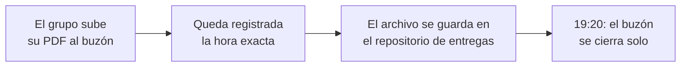

Entregas en clases
<h1>📬 Buzones de entrega</h1>

Cada avance del proyecto tiene su propio buzón. Se abre durante la clase, se cierra
automáticamente a las <strong>19:20</strong> del mismo día, y lo recibido queda archivado en el
repositorio del curso.

!!! danger "Las tres reglas del buzón"
    1. **Un PDF por grupo**, con el **nombre del grupo** escrito igual que en la planilla del curso.
    2. **Solo se evalúa lo enviado hasta las 19:00.** El buzón acepta hasta las 19:20 como margen de
       cierre, pero lo que llegue después de las 19:00 queda registrado como fuera de plazo.
    3. **A las 19:20 el buzón se cierra solo.** No hay forma de entregar después, salvo
       justificación presentada por los canales formales de la Universidad.

## Cómo funciona

Cada envío queda en el repositorio [ia-course-entregas](https://github.com/hizocar/ia-course-entregas)
como `entregas/<avance>/<nombre-del-grupo>.pdf`, junto a un registro con la hora de recepción. Si un
grupo reenvía, se guarda la última versión y el registro conserva ambos envíos.

## Buzón de cada avance

### 🚀 Hito 6A · 4%
**Miércoles 7 de octubre** · Primera mitigación implementada

*Backlog priorizado + cambio implementado con antes y después*

[📬 Abrir buzón](https://script.google.com/macros/s/AKfycbz7ZR7YRvRjDcpEgcjCeIcI8qzfBShLpPoxmYisZS4t8GeEDbEvAp9lg1sIrZKBiLyQ7A/exec?a=hito6a){.usm-btn target="_blank" rel="noopener"}

### 🚀 Hito 6B · 3%
**Miércoles 14 de octubre** · Comparación v1 vs. v2

*Banco de casos + tabla de comparación*

[📬 Abrir buzón](https://script.google.com/macros/s/AKfycbz7ZR7YRvRjDcpEgcjCeIcI8qzfBShLpPoxmYisZS4t8GeEDbEvAp9lg1sIrZKBiLyQ7A/exec?a=hito6b){.usm-btn target="_blank" rel="noopener"}

### 🚀 Hito 6C · 3%
**Lunes 19 de octubre** · Prototipo v2 cerrado

*Configuración final + documentación del cambio*

[📬 Abrir buzón](https://script.google.com/macros/s/AKfycbz7ZR7YRvRjDcpEgcjCeIcI8qzfBShLpPoxmYisZS4t8GeEDbEvAp9lg1sIrZKBiLyQ7A/exec?a=hito6c){.usm-btn target="_blank" rel="noopener"}

### 🚀 Hito 7A · 2,5%
**Miércoles 21 de octubre** · Impacto social

*Beneficios y costos sociales de la iniciativa*

[📬 Abrir buzón](https://script.google.com/macros/s/AKfycbz7ZR7YRvRjDcpEgcjCeIcI8qzfBShLpPoxmYisZS4t8GeEDbEvAp9lg1sIrZKBiLyQ7A/exec?a=hito7a){.usm-btn target="_blank" rel="noopener"}

### 🚀 Hito 7B · 2,5%
**Lunes 26 de octubre** · Evaluación privada

*Quién gana, quién paga, a cuántos alcanza*

[📬 Abrir buzón](https://script.google.com/macros/s/AKfycbz7ZR7YRvRjDcpEgcjCeIcI8qzfBShLpPoxmYisZS4t8GeEDbEvAp9lg1sIrZKBiLyQ7A/exec?a=hito7b){.usm-btn target="_blank" rel="noopener"}

### 🚀 Hito 7C · 2,5%
**Miércoles 28 de octubre** · Costos de operar

*Estructura de costos con supuestos explícitos*

[📬 Abrir buzón](https://script.google.com/macros/s/AKfycbz7ZR7YRvRjDcpEgcjCeIcI8qzfBShLpPoxmYisZS4t8GeEDbEvAp9lg1sIrZKBiLyQ7A/exec?a=hito7c){.usm-btn target="_blank" rel="noopener"}

### 🚀 Hito 7D · 2,5%
**Lunes 2 de noviembre** · Beneficio y conclusión

*Beneficio esperado y veredicto de viabilidad*

[📬 Abrir buzón](https://script.google.com/macros/s/AKfycbz7ZR7YRvRjDcpEgcjCeIcI8qzfBShLpPoxmYisZS4t8GeEDbEvAp9lg1sIrZKBiLyQ7A/exec?a=hito7d){.usm-btn target="_blank" rel="noopener"}

### 🎤 Pitch · Avance 1 · 5%
**Miércoles 4 de noviembre** · Estructura del pitch

[📬 Abrir buzón](https://script.google.com/macros/s/AKfycbz7ZR7YRvRjDcpEgcjCeIcI8qzfBShLpPoxmYisZS4t8GeEDbEvAp9lg1sIrZKBiLyQ7A/exec?a=pitcha){.usm-btn target="_blank" rel="noopener"}

### 🎤 Pitch · Avance 2 · 5%
**Lunes 9 de noviembre** · Ensayo con retroalimentación

[📬 Abrir buzón](https://script.google.com/macros/s/AKfycbz7ZR7YRvRjDcpEgcjCeIcI8qzfBShLpPoxmYisZS4t8GeEDbEvAp9lg1sIrZKBiLyQ7A/exec?a=pitchb){.usm-btn target="_blank" rel="noopener"}

!!! warning "Entregas anteriores"
    Los avances del **Hito 5** (28 y 30 de septiembre) se recibieron por correo, antes de habilitar
    el buzón. Desde el Hito 6 en adelante, la entrega es por este medio.

## Preguntas frecuentes

??? question "¿Qué pasa si el PDF está incompleto?"
    Envíenlo igual. Un avance parcial entregado dentro del horario se evalúa; uno completo enviado
    después, no.

??? question "¿Puedo reenviar si me equivoqué de archivo?"
    Sí, mientras el buzón siga abierto. Se conserva la última versión recibida y el registro deja
    constancia de ambos envíos.

??? question "¿Qué pasa si no pude asistir a la clase?"
    El avance de esa sesión se pierde, salvo justificación presentada por los canales formales de la
    Universidad. Avisa a **sebastian.azocarm@usm.cl** apenas tengas el respaldo.

??? question "¿Dónde queda mi entrega?"
    En el repositorio [ia-course-entregas](https://github.com/hizocar/ia-course-entregas), en la
    carpeta del avance correspondiente.
