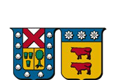
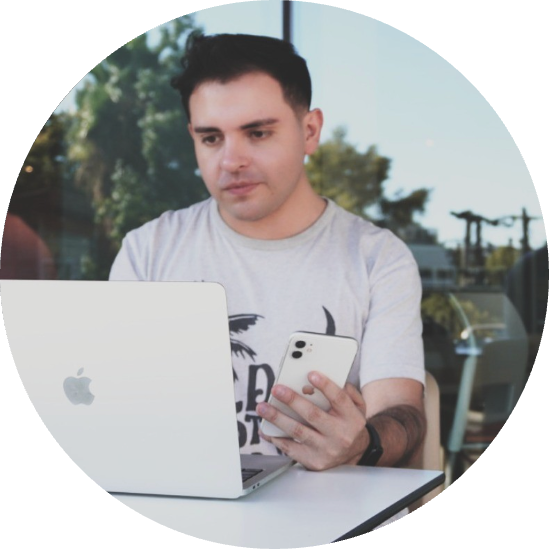

ICS64225 · Ingeniería Comercial
<h1>Inteligencia Artificial y Estrategia Empresarial</h1>

Universidad Técnica Federico Santa María — un electivo profesional para imaginar, diseñar y
liderar organizaciones más ágiles, competitivas y visionarias en la era de la IA.

Créditos SCT-Chile5

Días de claseLunes y Miércoles

Horario17:30 – 19:00

Duración90 min / clase

Inicio3 de agosto 2026

Término18 de noviembre 2026

> 🗓️ Revisa el detalle semana a semana en [**Calendario**](calendario.md).

## 📌 Descripción

Esta asignatura electiva tiene por objetivo complementar, expandir y enriquecer la formación del
estudiantado, abriendo su mirada hacia una nueva era de gestión empresarial impulsada por la
Inteligencia Artificial, el Internet de las Cosas y otras tecnologías emergentes. Su propósito es
conectar la estrategia, la economía, la innovación y el análisis de datos para imaginar, diseñar y
liderar organizaciones más ágiles, competitivas y visionarias en un entorno caracterizado por el
cambio acelerado.

Con un enfoque aplicado y no técnico, el curso combina análisis de casos, simulaciones, desarrollo
de prototipos conceptuales y propuestas de negocio sustentadas en el uso estratégico de la
Inteligencia Artificial.

## 🚀 Proyecto del curso

Durante todo el semestre, el mismo equipo formado en la Clase 1 desarrolla **un solo proyecto**:
una solución de negocio real construida con ChatGPT, Claude, Gemini u otras herramientas de IA sin
programar — desde la idea hasta un prototipo funcional y un pitch final de viabilidad.

<ul class="usm-timeline">
<li>
Hito 1 — Idea y problema de IA formulado
5 de agosto
</li>
<li>
Hito 2 — Prototipo funcional con herramientas de IA
21 de octubre
</li>
<li>
Hito 3 — Proyecto final y pitch
9 al 16 de noviembre
</li>
</ul>

[Ver el proyecto completo →](proyecto.md)

## 👤 Docente

### Sebastián Azócar
Data Scientist @ LATAM Airlines Group · Profesor part-time UTFSM

Ingeniero Matemático con más de 5 años de experiencia aplicando Machine Learning en la industria
—Caja Los Andes, Walmart Chile y actualmente LATAM Airlines Group— y más de una década formando
nuevas generaciones en ciencia de datos y estadística, hoy como profesor part-time en la
Universidad Técnica Federico Santa María.

[🔗 LinkedIn](https://www.linkedin.com/in/sebasti%C3%A1n-az%C3%B3car/)

### 💼 Experiencia profesional

<ul class="usm-timeline">
<li class="usm-current">
Data Scientist — LATAM Airlines GroupActual
2,5 años
</li>
<li>
Data Scientist — Walmart Chile
1 año
</li>
<li>
Data Scientist Expert — Caja Los Andes
2 años
</li>
</ul>

### 🏫 Docencia universitaria

<ul class="usm-timeline">
<li class="usm-current">
Profesor part-time — Universidad Técnica Federico Santa MaríaActual
4 años
</li>
<li>
Profesor — Universidad Diego Portales
8 años
</li>
</ul>

### 🎓 Formación académica

<ul class="usm-timeline">
<li>
Magíster en Data Science
Universidad del Desarrollo
</li>
<li>
Ingeniería Matemática
Universidad de Santiago de Chile (USACH)
</li>
</ul>

---

> 📚 Revisa el [Programa de la asignatura](programa.md) para conocer resultados de aprendizaje,
> contenidos, evaluación y bibliografía, o entra directo a las [Clases](clases/clases.md).
